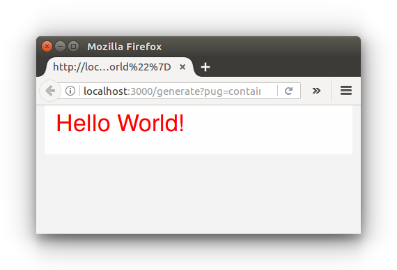

# Civinky: Pug and Inky for CiviMail

A web service that converts a Pug template, written with Inky tags to html ready for CiviMail.

## Installation

Create a local instance of Civinky as follows:

```
npm install
node index.js
```

Civinky should be ready to generate HTML via a get request to localhost:3000/generate.

## Usage

Call localhost:3000/generate with your required query parameters as described below.

**pug**

*Use Inky tags for best results.*

```
container
 row
  columns
   h1 Hello #{planet}!
```


**css**

*Will be added to Foundation's base CSS.*

```
h1{color:red}
```

**json**

*Will be passed to the Pug template.*

```
{"planet":"World"}
```

The following example URL encodes the above parameters and will produce HTML that looks something like the image below:

http://localhost:3000/generate?pug=container%0A%20row%0A%20%20columns%0A%20%20%20h1%20Hello%20%23%7Bplanet%7D!%0A&css=h1%7Bcolor:red%7D&json=%7B%22planet%22:%22World%22%7D


